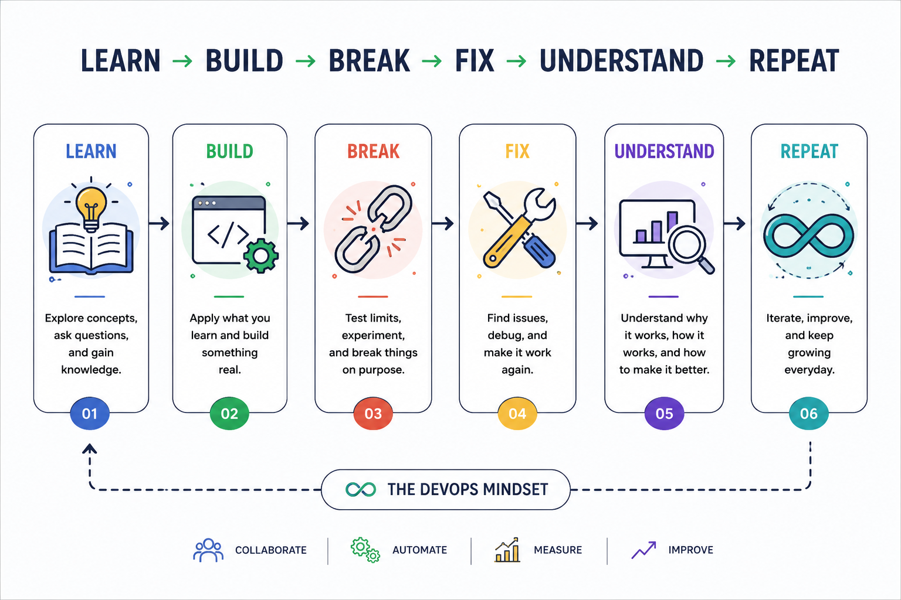

# Study With Me 🚀

 
**Learning DevOps by doing, building, breaking, fixing, and documenting.**
 
Welcome to **Study With Me**, a repository that captures my journey of learning and growing in the world of DevOps, Cloud, and SRE.
 
This is more than a collection of notes. It is a place where I turn concepts into practice, explore how systems work, experiment with different technologies, solve problems, and document the lessons along the way.
 
You'll find practical learning, hands-on experiments, projects, troubleshooting, workflows, and notes covering areas such as:
 
- ⚙️ DevOps & Automation
- ☁️ Cloud & Infrastructure
- 🐧 Linux & Networking
- 🔀 Git & GitHub
- 🐳 Docker & Containers
- 🔄 CI/CD
- 🏗️ Infrastructure as Code
- ☸️ Kubernetes
- 📊 Monitoring & Observability
- 🛠️ Real-world troubleshooting and projects
## What makes this repository different?
 
I'm not aiming to simply collect technologies or memorize commands.
 
I want to understand how things work, why they work, what happens when they fail, and how to fix them.
 
So this repository will contain both the things that worked and the things that didn't.
 
Every folder represents a part of the learning process. Every project is an opportunity to apply what I've learned. Every problem is another chance to understand systems a little better.
 
> **Learn → Build → Break → Fix → Understand → Repeat**
 
This repository will continue to evolve as my skills and experience grow.
 
If you're here to learn, explore, or simply see how the journey develops, welcome aboard.
 
Let's build, break, learn, and grow. 🚀
